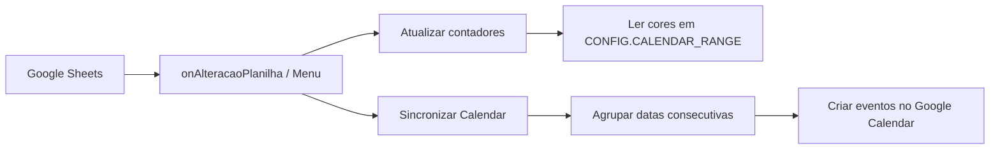

# Vacation Mode


Script Google Apps Script para gerir férias numa folha de cálculo anual e sincronizar períodos com o Google Calendar.

## Índice

- [Visão geral](#visão-geral)
- [Funcionalidades](#funcionalidades)
- [Stack](#stack)
- [Requisitos](#requisitos)
- [Instalação](#instalação)
- [Configuração](#configuração)
- [Utilização](#utilização)
- [Estrutura da folha](#estrutura-da-folha)
- [Menus e funções](#menus-e-funções)
- [Arquitetura](#arquitetura)
- [Validação](#validação)
- [Resolução de problemas](#resolução-de-problemas)
- [Segurança](#segurança)
- [Manutenção](#manutenção)
- [Licença](#licença)

## Visão geral

O projeto distribui um único ficheiro (`Vacation_Mode.js`) para colar no editor do Google Apps Script associado a uma folha de cálculo com calendário anual.

A grelha anual baseia-se no calendário em Excel com feriados nacionais portugueses disponibilizado em [Economia e Finanças](https://economiafinancas.com), na secção de utilitários/calendário.

O fluxo principal:

1. O utilizador pinta dias de férias e aniversário na grelha.
2. O script conta dias gozados, planeados e restantes.
3. O script cria ou atualiza eventos de dia inteiro no Google Calendar, agrupando dias consecutivos.

## Funcionalidades

| Área | Descrição |
| --- | --- |
| Contadores | Cálculo de férias gozadas, planeadas, totais, restantes e dia de aniversário. |
| Multi-folha | Suporte a várias folhas anuais no mesmo ficheiro. |
| Google Calendar | Criação de eventos com título configurável e marcador interno. |
| Agrupamento | Dias úteis seguidos separados apenas por fins de semana são reunidos num único evento, com contagem em dias de calendário. |
| Sincronização ao colorir | Trigger `onChange` reage a alterações de cor e formato na folha. |
| Automação | Trigger temporal opcional a cada 5 minutos. |
| Diagnóstico | Função para validar cores reconhecidas na grelha. |

## Stack

| Componente | Tecnologia |
| --- | --- |
| Script | Google Apps Script (JavaScript) |
| Interface | Menu personalizado no Google Sheets |
| Integração | `SpreadsheetApp`, `CalendarApp`, `ScriptApp`, `LockService`, `PropertiesService` |
| Distribuição | Cópia manual de `Vacation_Mode.js` |

## Requisitos

- Conta Google com acesso ao Google Sheets e Google Calendar.
- Folha de cálculo com grelha anual configurável.
- Autorização do script na primeira execução.

Não há dependências locais nem processo de build.

## Instalação

1. Abrir a folha de cálculo alvo.
2. Ir a `Extensões` > `Apps Script`.
3. Colar o conteúdo de `Vacation_Mode.js`.
4. Guardar o projeto.
5. Recarregar a folha e confirmar o menu `Gestão de Férias`.
6. Executar `Ativar Sincronização Automática` se quiser sincronização ao colorir.

## Configuração

A configuração principal está no objeto `CONFIG`, no topo de `Vacation_Mode.js`.

| Chave | Valor por omissão | Descrição |
| --- | --- | --- |
| `CALENDAR_RANGE` | `C5:AM16` | Intervalo da grelha anual (12 meses × até 31 dias). |
| `CORES.FERIAS_ATUAL` | `#d9d2e9` | Férias do ano corrente. |
| `CORES.FERIAS_ATUAL_ALT` | `#b4a7d6` | Variante aceite de férias. |
| `CORES.FERIAS_ANTERIOR` | `#fff2cc` | Dias transitados do ano anterior. |
| `CORES.ANIVERSARIO` | `#d9ead3` | Dia de aniversário. |
| `CALENDARIO.NOME` | vazio | Calendário principal quando vazio. |
| `CALENDARIO.TITULO_EVENTO` | `Férias` | Título-base dos eventos. |
| `CALENDARIO.MARCADOR` | `[FERIAS_AUTO]` | Marcador dos eventos gerados pelo script. |

As células dos contadores estão em `CONFIG.CELULAS` (por omissão, coluna `C`, linhas `18`–`27`).

## Utilização

### Fluxo manual

1. Pintar os dias de férias com uma cor configurada.
2. Abrir `Gestão de Férias` > `SINCRONIZAR TUDO`.

### Sincronização automática ao colorir

1. Abrir `Gestão de Férias` > `Ativar Sincronização Automática`.
2. Pintar ou alterar dias na grelha anual.
3. O script sincroniza contadores e Calendar após alterações de cor (`FORMAT`) ou edição relevante (`EDIT`).

Também existe um trigger temporal de 5 minutos como rede de segurança.

## Estrutura da folha

- Grelha anual em `CONFIG.CALENDAR_RANGE`.
- Cada linha representa um mês; cada coluna, um dia.
- Folhas com nomes como `Calendário 2026` ou `Calendário de férias` são detetadas automaticamente.
- Se o nome da folha não contiver ano, usa-se o ano corrente.

## Menus e funções

| Menu | Função | Efeito |
| --- | --- | --- |
| `SINCRONIZAR TUDO` | `sincronizarTudo` | Atualiza contadores e Calendar. |
| `Atualizar Contadores` | `atualizarContadores` | Recalcula apenas contadores. |
| `Sincronizar com Calendar` | `sincronizarComCalendar` | Atualiza apenas eventos. |
| `Ativar Sincronização Automática` | `instalarTriggerAutomatico` | Instala triggers de 5 min e `onChange`. |
| `Testar Deteção de Cores` | `testarDetecaoCores` | Diagnóstico de cores na grelha. |

Funções auxiliares no editor do Apps Script: `configurarSheet()`, `atualizarCoresAutomaticamente()`.

## Arquitetura



## Validação

Localmente:

```bash
node --check Vacation_Mode.js
```

No Google Sheets:

1. Pintar dois dias consecutivos de férias.
2. Executar `Testar Deteção de Cores`.
3. Executar `SINCRONIZAR TUDO` ou ativar sincronização automática.
4. Confirmar contadores e um evento agrupado no Calendar.

## Resolução de problemas

| Problema | Verificação |
| --- | --- |
| Menu ausente | Recarregar a folha e confirmar que o script foi guardado. |
| Cores não contam | Executar `Testar Deteção de Cores` e ajustar `CONFIG.CORES`. |
| Colorir não sincroniza | Reativar `Ativar Sincronização Automática` para instalar `onAlteracaoPlanilha`. |
| Eventos duplicados | Confirmar que `CALENDARIO.MARCADOR` não foi alterado entre execuções. |
| Ano incorreto | Incluir o ano no nome da folha ou ajustar `CONFIG.CALENDARIO.ANO`. |

## Segurança

- Não versionar `.clasp.json`, `appsscript.json` nem credenciais.
- O script lê a folha e pode criar ou remover eventos no calendário configurado.

Ver também [`.github/SECURITY.md`](.github/SECURITY.md).

## Manutenção

- Histórico: [`CHANGELOG.md`](CHANGELOG.md)
- Política de versionamento: [`docs/ai/policies/CHANGELOG_POLICY.md`](docs/ai/policies/CHANGELOG_POLICY.md)
- Contexto técnico: [`PROJECT_CONTEXT.md`](PROJECT_CONTEXT.md)
- Comandos: [`COMMANDS.md`](COMMANDS.md)

## Licença

MIT.
