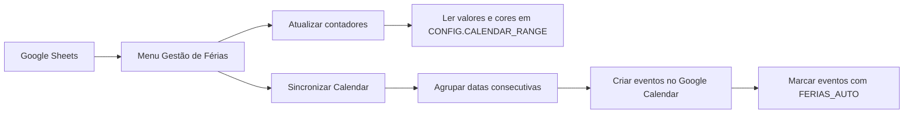

# Vacation Mode

Automatização de férias para Google Sheets, com contadores anuais e sincronização direta com o Google Calendar.

> **Nota:** este projeto é distribuído como um único ficheiro Google Apps Script (`Vacation_Mode.js`) para ser copiado para o editor do Apps Script associado ao Google Sheets.

## Índice

- [Visão Geral](#visão-geral)
- [Funcionalidades](#funcionalidades)
- [Stack Técnica](#stack-técnica)
- [Requisitos](#requisitos)
- [Instalação](#instalação)
- [Configuração](#configuração)
- [Utilização](#utilização)
- [Estrutura Esperada Da Folha](#estrutura-esperada-da-folha)
- [Comandos E Menus](#comandos-e-menus)
- [Arquitetura Técnica](#arquitetura-técnica)
- [Testes E Validação](#testes-e-validação)
- [Troubleshooting](#troubleshooting)
- [Segurança E Segredos](#segurança-e-segredos)
- [Manutenção](#manutenção)
- [Licença](#licença)

## Visão Geral

O Vacation Mode automatiza a gestão de férias num calendário em Google Sheets. O utilizador pinta os dias no calendário, e o script:

- conta férias gozadas, planeadas, totais e restantes;
- conta o dia de aniversário;
- cria eventos de dia inteiro no Google Calendar;
- agrupa dias consecutivos num único evento;
- suporta várias folhas anuais no mesmo ficheiro.

O projeto foi inspirado no calendário em Excel com feriados da Economia e Finanças: <https://economiafinancas.com/>.

## Funcionalidades

| Área | Funcionalidade |
| --- | --- |
| Contadores | Cálculo automático de férias gozadas, férias planeadas, total planeado, dias restantes e dia de aniversário. |
| Multi-ano | Deteção de folhas com nomes como `Calendario 2025` ou `Calendário 2026`. |
| Google Calendar | Criação de eventos de dia inteiro com título configurável e descrição com referência à folha. |
| Agrupamento | Dias consecutivos são reunidos num único evento. |
| Proteção contra duplicados | Eventos criados pelo script são identificados pelo título e pelo marcador `[FERIAS_AUTO]`. |
| Automação | Triggers opcionais para sincronização a cada 5 minutos e quando há alterações na folha. |
| Diagnóstico | Menu para testar cores detetadas na grelha do calendário. |

## Stack Técnica

| Componente | Tecnologia |
| --- | --- |
| Script | Google Apps Script, com sintaxe JavaScript |
| Interface | Menu personalizado no Google Sheets |
| Integração | `SpreadsheetApp`, `CalendarApp`, `ScriptApp` e `LockService` |
| Dados | Células do Google Sheets e eventos no Google Calendar |
| Distribuição | Cópia manual do ficheiro `Vacation_Mode.js` para o Apps Script |

## Requisitos

- Conta Google com acesso ao Google Sheets e Google Calendar.
- Um Google Sheets com grelha anual de calendário.
- Permissão para editar o ficheiro e autorizar o Apps Script.
- Acesso ao calendário principal ou a um calendário próprio indicado em `CONFIG.CALENDARIO.NOME`.

Não há dependências locais obrigatórias nem processo de build confirmado.

## Instalação

1. Abra o Google Sheets onde pretende gerir as férias.
2. Aceda a `Extensões` > `Apps Script`.
3. Apague o código existente no editor, se for seguro fazê-lo.
4. Cole o conteúdo de `Vacation_Mode.js`.
5. Guarde o projeto.
6. Volte ao Google Sheets e recarregue a página.
7. Confirme que aparece o menu `Gestão de Férias`.

Na primeira execução de ações que acedem ao Calendar, o Google pode pedir autorização para o script consultar e criar eventos.

## Configuração

A configuração principal fica no objeto `CONFIG`, no topo de `Vacation_Mode.js`.

### Intervalo Do Calendário

| Chave | Valor por omissão | Descrição |
| --- | --- | --- |
| `CALENDAR_RANGE` | `C5:AM16` | Intervalo com 12 linhas, uma por mês, e até 31 colunas, uma por dia. |

Altere este valor se a grelha anual do seu Google Sheets estiver noutro local.

### Cores Reconhecidas

| Chave | Cor | Uso |
| --- | --- | --- |
| `CORES.FERIAS_ATUAL` | `#d9d2e9` | Férias planeadas do ano corrente. |
| `CORES.FERIAS_ATUAL_ALT` | `#b4a7d6` | Variante aceite para férias do ano corrente. |
| `CORES.FERIAS_ANTERIOR` | `#fff2cc` | Dias transitados do ano anterior. |
| `CORES.ANIVERSARIO` | `#d9ead3` | Dia de aniversário. |

Use o menu `Testar Deteção de Cores` se os contadores não reconhecerem os dias pintados.

### Células Dos Contadores

| Chave | Célula | Descrição |
| --- | --- | --- |
| `FERIAS_DISPONIVEIS` | `C18` | Dias disponíveis no ano corrente, preenchidos manualmente. |
| `FERIAS_ANTERIOR` | `C19` | Dias transitados do ano anterior, preenchidos manualmente. |
| `FERIAS_GOZADAS` | `C20` | Dias de férias já passados. |
| `FERIAS_PLANEADAS` | `C21` | Dias de férias futuros. |
| `FERIAS_TOTAL` | `C22` | Soma de férias gozadas e planeadas. |
| `FERIAS_RESTANTES` | `C23` | Saldo restante. |
| `ANIVERSARIO_DISPONIVEL` | `C25` | Dia de aniversário disponível. |
| `ANIVERSARIO_GOZADO` | `C26` | Dia de aniversário já gozado. |
| `ANIVERSARIO_A_GOZAR` | `C27` | Dia de aniversário ainda por gozar. |

### Google Calendar

| Chave | Valor por omissão | Descrição |
| --- | --- | --- |
| `CALENDARIO.NOME` | vazio | Usa o calendário principal quando fica vazio. |
| `CALENDARIO.TITULO_EVENTO` | `Férias` | Título-base dos eventos criados. |
| `CALENDARIO.ANO` | ano atual | Fallback quando a folha não contém ano no nome. |
| `CALENDARIO.MARCADOR` | `[FERIAS_AUTO]` | Marcador interno para identificar eventos gerados pelo script. |

## Utilização

### Fluxo Manual Recomendado

1. Garanta que a folha tem nome como `Calendario 2026` ou `Calendário 2026`.
2. Pinte os dias de férias com uma das cores configuradas.
3. Pinte o dia de aniversário com a cor configurada, se aplicável.
4. Abra o menu `Gestão de Férias`.
5. Execute `SINCRONIZAR TUDO`.

Este fluxo atualiza os contadores e sincroniza os eventos do Google Calendar numa única ação.

### Sincronização Automática

1. Abra o menu `Gestão de Férias`.
2. Execute `Ativar Sincronização Automática`.
3. Autorize o script, se o Google pedir permissões.

O script instala:

- um trigger temporal que executa `sincronizarTudo()` a cada 5 minutos;
- um trigger `onChange` para apanhar alterações de formatação e cor.

Use `Desativar Sincronização Automática` para remover estes triggers.

### Apenas Contadores Ou Apenas Calendar

| Ação | Quando usar |
| --- | --- |
| `Atualizar Contadores` | Quando só quer recalcular valores no Google Sheets. |
| `Sincronizar com Calendar` | Quando os contadores já estão corretos e só quer atualizar eventos. |

## Estrutura Esperada Da Folha

- A grelha anual deve estar em `C5:AM16`, salvo alteração de `CONFIG.CALENDAR_RANGE`.
- Cada linha representa um mês.
- As colunas representam os dias do mês.
- As células de dias devem conter números, texto numérico ou datas reais formatadas como dia.
- As folhas anuais devem conter um ano no nome, por exemplo `Calendario 2025`.

Se nenhuma folha com esse padrão for encontrada, o script usa a folha ativa como fallback.

## Comandos E Menus

Não existem comandos locais obrigatórios. A operação diária é feita pelo menu criado no Google Sheets.

| Menu | Função Apps Script | Efeito |
| --- | --- | --- |
| `SINCRONIZAR TUDO` | `sincronizarTudo` | Atualiza contadores e sincroniza eventos para todas as folhas anuais. |
| `Atualizar Contadores` | `atualizarContadores` | Recalcula apenas os contadores da folha. |
| `Sincronizar com Calendar` | `sincronizarComCalendar` | Atualiza apenas os eventos no Google Calendar. |
| `Ativar Atualização ao Editar` | `instalarTrigger` | Instala trigger `onEdit` para contadores. |
| `Ativar Sincronização Automática` | `instalarTriggerAutomatico` | Instala sincronização periódica e `onChange`. |
| `Desativar Atualização ao Editar` | `removerTrigger` | Remove o trigger `onEdit`. |
| `Desativar Sincronização Automática` | `removerTriggerAutomatico` | Remove triggers automáticos de sincronização. |
| `Testar Deteção de Cores` | `testarDetecaoCores` | Regista e mostra diagnóstico das cores reconhecidas. |
| `Ajuda` | `mostrarAjuda` | Mostra instruções rápidas dentro do Google Sheets. |

## Arquitetura Técnica

### Módulos Lógicos

| Área | Funções principais |
| --- | --- |
| Deteção de folhas e datas | `obterFolhasCalendario`, `obterAnoDaSheet`, `obterDataDaCelula` |
| Contadores | `atualizarContadores`, `processarCelula`, `atualizarCelulasContadores` |
| Calendar | `sincronizarComCalendar`, `obterCalendario`, `limparEventosAntigos`, `agruparDatasConsecutivas` |
| Triggers | `instalarTrigger`, `instalarTriggerAutomatico`, `removerTrigger`, `removerTriggerAutomatico` |
| Diagnóstico | `testarDetecaoCores`, `mostrarAjuda` |

## Testes E Validação

Não há testes automatizados locais confirmados.

Validação manual recomendada:

1. Criar ou duplicar uma folha `Calendario YYYY`.
2. Pintar um conjunto pequeno de dias de férias, incluindo pelo menos dois dias consecutivos.
3. Executar `Testar Deteção de Cores`.
4. Executar `SINCRONIZAR TUDO`.
5. Confirmar que os contadores foram atualizados.
6. Confirmar que o Google Calendar recebeu um evento agrupado.
7. Reexecutar `SINCRONIZAR TUDO` e confirmar que não surgem duplicados.

## Troubleshooting

| Problema | Verificação |
| --- | --- |
| O menu não aparece | Recarregue o Google Sheets e confirme que o código foi guardado no Apps Script. |
| Os dias pintados não contam | Execute `Testar Deteção de Cores` e compare as cores com `CONFIG.CORES`. |
| Eventos não são criados | Confirme permissões do Apps Script e acesso ao calendário configurado. |
| Eventos duplicados | Confirme que `CALENDARIO.TITULO_EVENTO` e `CALENDARIO.MARCADOR` não foram alterados entre execuções. |
| Ano errado | Confirme que o nome da folha contém o ano correto, como `Calendário 2026`. |
| Contadores em células erradas | Ajuste `CONFIG.CELULAS` para coincidir com a legenda da folha. |

## Segurança E Segredos

- Não versionar credenciais, tokens, `.clasp.json` ou `appsscript.json`.
- O `.gitignore` já exclui metadados locais do Google Apps Script e ficheiros Office/Sheets.
- O script deve ser autorizado apenas por utilizadores que compreendam que ele pode ler a folha e criar/remover eventos no Calendar configurado.

## Manutenção

- Consulte o histórico em [`CHANGELOG.md`](CHANGELOG.md).
- Consulte a política de versionamento em [`CHANGELOG_POLICY.md`](CHANGELOG_POLICY.md).
- Mantenha o contexto técnico em [`PROJECT_CONTEXT.md`](PROJECT_CONTEXT.md).
- Ao alterar configuração, fluxos, comandos ou comportamento, atualize a documentação na mesma alteração.

## Licença

MIT. Atribuição apreciada: Emanuel Ferreira ([@emanuwells](https://github.com/emanuwells)).
